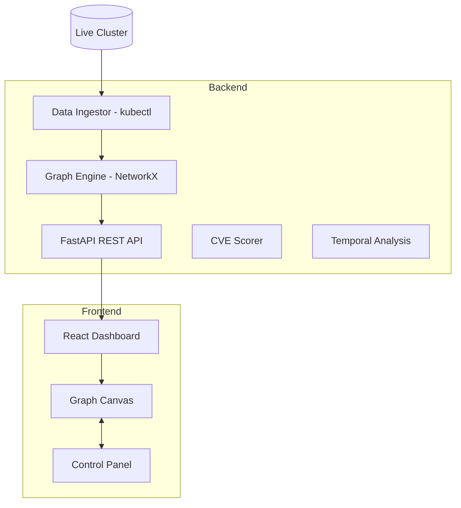

# 🛡️ KubePathAudit
**Graph-Based Security Analysis for Cloud-Native Infrastructure**

[](https://opensource.org/licenses/MIT)
[](https://kubernetes.io/)
[](https://reactjs.org/)
[](https://fastapi.tiangolo.com/)

---

## 📖 Overview
**KubePathAudit** models a Kubernetes cluster as a directed graph and applies classical graph algorithms to detect exploitable multi-hop attack paths. It identifies chains of permissions that appear harmless in isolation but enable lateral movement to crown-jewel resources.

---

## 🏗️ Architecture



---

## 🚀 Quick Start

### 📋 Prerequisites
- **Python 3.10+**
- **Node.js 18+** (for the web dashboard)
- **`kubectl`** (optional — for live cluster ingestion)

### ⚙️ Backend Setup
```bash
cd backend
pip install -r requirements.txt
```

### ⌨️ Run the CLI
```bash
# Full analysis with all 4 algorithms
python cli.py analyze --input mock-cluster-graph.json

# Show top 3 critical attack paths with mitigation advice
python cli.py top-critical-paths --input mock-cluster-graph.json

# Generate a PDF Kill Chain Report
python cli.py analyze --input mock-cluster-graph.json --pdf report.pdf
```

### 💻 Run the Web Dashboard
```bash
# Terminal 1 — Backend API
cd backend
uvicorn main:app --reload

# Terminal 2 — Frontend
cd frontend
npm install
npm run dev
```
Open [http://localhost:5173](http://localhost:5173) in your browser.

---

## 🛠️ CLI Reference

### `analyze` — Full Security Analysis
Runs all 4 algorithms (BFS, Dijkstra, DFS, Critical Node) and outputs a complete Kill Chain Report.

```bash
python cli.py analyze --input mock-cluster-graph.json
python cli.py analyze -i mock-cluster-graph.json --pdf report.pdf
python cli.py analyze -i mock-cluster-graph.json --json
```

| Flag | Description |
|---|---|
| `--input`, `-i` | Path to cluster graph JSON (default: `mock-cluster-graph.json`) |
| `--pdf FILE` | Export the report as a PDF file |
| `--json` | Output all results as a JSON object |
| `--hops N` | Max hops for blast radius (default: 3) |
| `--diff` | Compare against the latest stored snapshot |
| `--snapshot` | Save current scan as a timestamped snapshot |

### `top-critical-paths` — Attack Path Discovery
Shows the most exploitable attack paths with detailed descriptions and mitigation suggestions.

```bash
python cli.py top-critical-paths --input mock-cluster-graph.json
python cli.py top-critical-paths -i mock-cluster-graph.json --count 5 --json
```

---

## 🧬 Algorithms

### 1️⃣ Blast Radius (BFS)
**Purpose:** If a node is compromised, how far can the attacker reach?
Runs breadth-first search from the source up to N hops, returning the "Danger Zone" — all reachable nodes and whether crown jewels are within reach.

### 2️⃣ Shortest Attack Path (Dijkstra)
**Purpose:** What is the easiest route from entry point to crown jewel?
Uses Dijkstra's algorithm with edge weights (exploitability scores) to find the lowest-cost attack path, then formats it as a Kill Chain with per-step CVE annotations.

### 3️⃣ Circular Permission Detection (DFS)
**Purpose:** Detect misconfigured mutual admin grants.
Uses DFS-based cycle detection to find circular permission loops (e.g., `Service-A ↔ Service-B` mutual admin grants).

### 4️⃣ Critical Node Analysis
**Purpose:** Which single node's removal breaks the most attack paths?
Uses betweenness centrality and node removal simulations to identify the most critical chokepoints in the infrastructure.

---

## 📂 Project Structure

```text
├── backend/
│   ├── cli.py                  # CLI entry point
│   ├── main.py                 # FastAPI REST API
│   ├── graph_engine.py         # Core graph analysis (NetworkX)
│   ├── ingest.py               # kubectl data ingestion
│   ├── requirements.txt        # Python dependencies
├── frontend/
│   ├── src/
│   │   ├── App.tsx             # Main dashboard
│   │   ├── components/         # React components
│   │   └── lib/                # API client, types, utilities
└── README.md
```

---

## 📄 License
Licensed under the [MIT License](LICENSE).
